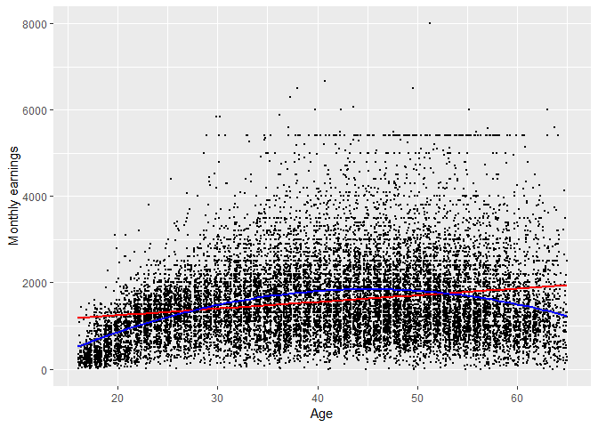
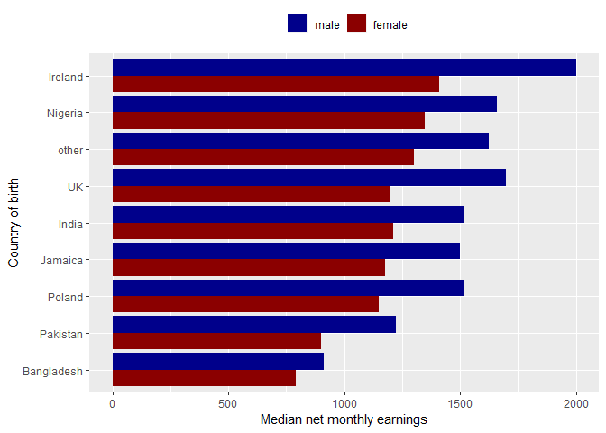
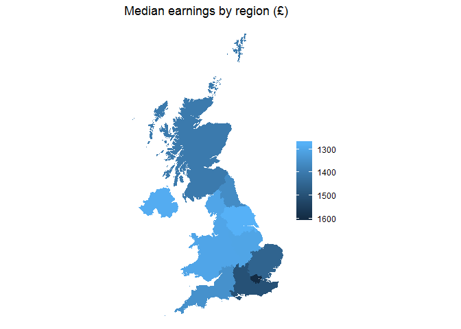

Statistical assignment 4
================
\[add your name here\] \[add your candidate number here - mandatory\]
\[add date here\]

In this assignment you will need to reproduce 5 ggplot graphs. I supply graphs as images; you need to write the ggplot2 code to reproduce them and knit and submit a Markdown document with the reproduced graphs (as well as your .Rmd file).

First we will need to open and recode the data. I supply the code for this; you only need to change the file paths.

Reproduce the following graphs as close as you can. For each graph, write two sentences (not more!) describing its main message.

1.  Histogram of the age distribution (20 points)

    

2.  Scatter plot: age and monthly earnings (20 points). The red line shows a linear fit; the blue line shows a quadratic fit. Note the size and position of points.

    

3.  Faceted density chart: age distribution by country of birth (20 points).

    

4.  Ordered bar chart of summary statistics: median earnings by sex and country of birth (20 points).

    

5.  Map: median income by UK region (20 points). This is the most difficult problem in this set. You will need to use the NUTS Level 1 shape file (available here -- <https://data.gov.uk/dataset/2aa6727d-c5f0-462a-a367-904c750bbb34/nuts-level-1-january-2018-full-clipped-boundaries-in-the-united-kingdom>) and a number of packages for producing maps from shape files. You will need to google additional information; there are multiple webpages with the code that produces similar maps.

    
