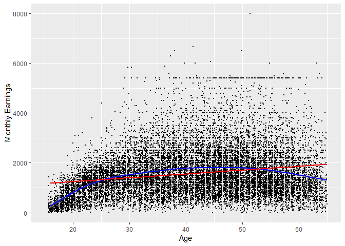

Statistical assignment 4
================
\[Kyle Morrs\] \[056527\]
\[11/03/2019\]

In this assignment you will need to reproduce 5 ggplot graphs. I supply graphs as images; you need to write the ggplot2 code to reproduce them and knit and submit a Markdown document with the reproduced graphs (as well as your .Rmd file).

First we will need to open and recode the data. I supply the code for this; you only need to change the file paths.

    ```r
    library(tidyverse)

    Data8 <- read_tsv("C:/Users/morri/Documents/data/UKDA-6614-tab/tab/ukhls_w8/h_indresp.tab")

    Data8 <- Data8 %>%
        select(pidp, h_age_dv, h_payn_dv, h_gor_dv)

    Stable <- read_tsv("C:/Users/morri/Documents/data/UKDA-6614-tab/tab/ukhls_wx/xwavedat.tab")

    Stable <- Stable %>%
        select(pidp, sex_dv, ukborn, plbornc)

    Data <- Data8 %>% left_join(Stable, "pidp")

    rm(Data8, Stable)

    Data <- Data %>%
        mutate(sex_dv = ifelse(sex_dv == 1, "male",
                           ifelse(sex_dv == 2, "female", NA))) %>%
        mutate(h_payn_dv = ifelse(h_payn_dv < 0, NA, h_payn_dv)) %>%
        mutate(h_gor_dv = recode(h_gor_dv,
                         `-9` = NA_character_,
                         `1` = "North East",
                         `2` = "North West",
                         `3` = "Yorkshire",
                         `4` = "East Midlands",
                         `5` = "West Midlands",
                         `6` = "East of England",
                         `7` = "London",
                         `8` = "South East",
                         `9` = "South West",
                         `10` = "Wales",
                         `11` = "Scotland",
                         `12` = "Northern Ireland")) %>%
        mutate(placeBorn = case_when(
                ukborn  == -9 ~ NA_character_,
                ukborn < 5 ~ "UK",
                plbornc == 5 ~ "Ireland",
                plbornc == 18 ~ "India",
                plbornc == 19 ~ "Pakistan",
                plbornc == 20 ~ "Bangladesh",
                plbornc == 10 ~ "Poland",
                plbornc == 27 ~ "Jamaica",
                plbornc == 24 ~ "Nigeria",
                TRUE ~ "other")
        )
    ```

Reproduce the following graphs as close as you can. For each graph, write two sentences (not more!) describing its main message.

(Note the position of the code chunks; each is preceded by four spaces. This helps display numbered lists correctly in the Markdown file with the output.)

1.  Histogram (20 points)

    ``` r
    Data %>%
      ggplot(aes(x = h_age_dv))+ 
      geom_histogram(bins = 87) +
      xlab ("Age")
    ```

    

    ``` r
      ylab ("Number of Respondents")
    ```

        ## $y
        ## [1] "Number of Respondents"
        ## 
        ## attr(,"class")
        ## [1] "labels"

    ``` r
      #Thee histogram shows the age of the respondents in relation to the number of respondents. It shows the number of respondents decreasing until roughly 25, then peaking at 50 before decreasing again 

    #Can we only figure out bins=87 through trial and error?
    ```

2.  Scatter plot (20 points). The red line shows a linear fit; the blue line shows a quadratic fit. Note the size and position of points.

    ``` r
    Data %>%

    ggplot(aes(x = h_age_dv, y = h_payn_dv)) +
    geom_point(position = position_jitter(width = NULL, height = NULL), size = 0.5)+
    xlim(15, 65) +
    geom_smooth(col = "blue")+
    geom_smooth(method = 'lm', formula = y~x, col = 'red') +
    xlab("Age") +
    ylab("Monthly Earnings")
    ```

    

    ``` r
    #The graph shows that as a whole higher age, higher income, albeit it a very weak relation, where as the blue line more accurately shows the income dependent on age regarding things (potentially) such as lack of experience at a younger age, hence less income, and retirment at the older age, hence less income.
    ```

3.  Faceted density chart (20 points).

    ``` r
    Data %>%

      filter(!is.na(placeBorn)) %>%


      ggplot(aes(x = h_age_dv)) +
      geom_density(fill = 'black') +
      facet_wrap( ~ placeBorn, ncol = 3) +
      xlab("Age") +
      ylab("Density")
    ```

    

    ``` r
       # Shows a list of countries with the spread of age a
    ```

4.  Ordered bar chart of summary statistics (20 points).

    ``` r
    Data$placeBorn <- factor(Data$placeBorn, levels = c("Bangladesh", "Pakistan", "Poland", "Jamaica", "India", "UK", "Other", "Nigeria", "Ireland"))

      Data %>%
      filter(!is.na(sex_dv) & !is.na(placeBorn)) %>%
      group_by(sex_dv, placeBorn) %>%
      summarise(MedianIncome = median(h_payn_dv, na.rm = TRUE)) %>%
      ggplot(aes(x = placeBorn, y = MedianIncome, fill = sex_dv)) +
      geom_bar(position = "dodge", stat= "identity") +
      scale_fill_manual(values = c("Dark Red","Dark Blue")) +
      theme(legend.position = "top", legend.title = element_blank()) +
      xlab("Country of birth") +
      ylab("Median net monthly earnings") +
      coord_flip()
    ```

    

    ``` r
    #Data shows that males earned significantly more than females, and that geography seemingly does not play as significant of a role. 
    ```

5.  Map (20 points). This is the most difficult problem in this set. You will need to use the NUTS Level 1 shape file (available here -- <https://data.gov.uk/dataset/2aa6727d-c5f0-462a-a367-904c750bbb34/nuts-level-1-january-2018-full-clipped-boundaries-in-the-united-kingdom>) and a number of packages for producing maps from shape files. You will need to google additional information; there are multiple webpages with the code that produces similar maps.
